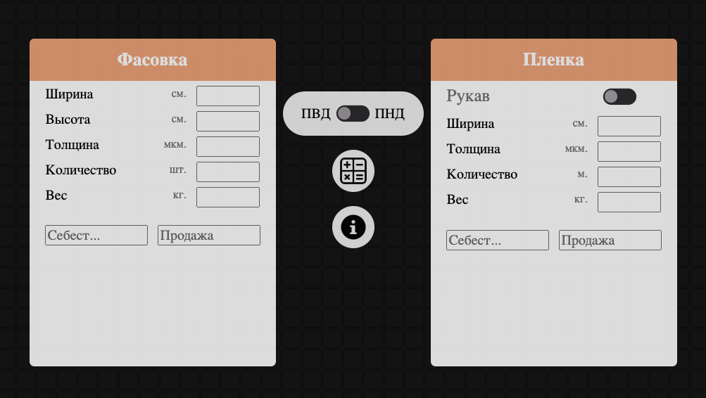
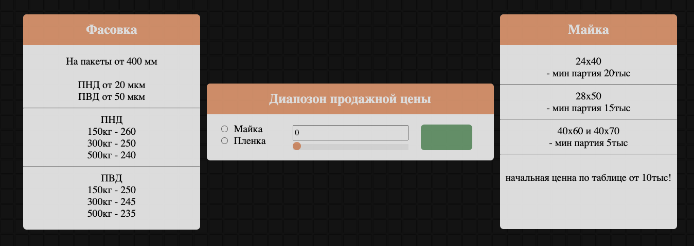
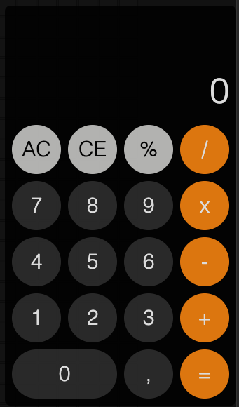

# My first version polimer calculator 

The calculator is written in pure JS.

# Галерея проекта

## Скриншоты

### Главный блок калькулятора

  

Описание: Это главный раздел блока, расчет пакетов и пленок разделен на два блока. Переключатель по центру производит смену материала в формулах.

### Блок подсказок

  

Описание: Данный блок вызывается по клику на символ "I". Подсказка дает возможность выбрать верную наценку на тиражи пакетов и пленок.

### Блок калькулятора

  

Описание: Данный блок вызывается по клику на символ "calc". Это полноценный калькулятор с дизайнов Apple. Блок можно передвигать по экрнау и фиксировать в удобном месте. Имеет память передвижений, при обновлении страницы будет открываться в том же месте.